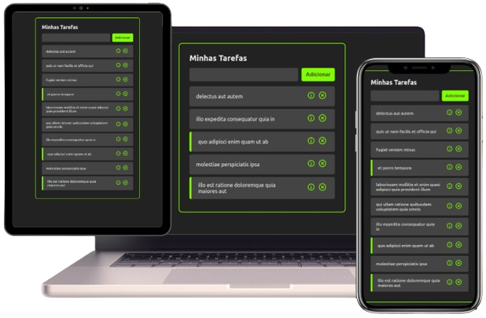

# Organizador de Tarefas

### Imagem do Projeto

   

### Sobre
Este foi meu primeiro projeto utilizando o React onde tive a oportunidade de compreender assuntos que vão desde Props, Hooks e React Router até o deploy da aplicação final.

### Tecnologias Utilizadas
O projeto foi construído utilizando uma variedade de tecnologias e ferramentas modernas:

- **HTML & CSS**: Estruturação e estilização do site.
- **React**: Utilizado para criar componentes e suas funcionalidades dinâmicas.
- **Git**: Utilizado no versionamento de todo projeto.

### Links
 

   <strong>Veja o projeto : </strong>
   <a href="https://to-do-list-at-react.vercel.app/" target="_blank" rel="external">ToDo List</a>
 

 
Desenvolvido dentro do
   <a href="https://www.youtube.com/watch?v=ErjWNvP6mko&list=PLm-VCNNTu3Ll3NE4NeR_HahjRVJnaVAkK&index=7" target="_blank" rel="external">Curso de React para Iniciantes</a> 
   , ministrado pelo professor Felipe Rocha no 
   <a href="https://www.youtube.com/@dicasparadevs" target="_blank" rel="external">Dicas para devs</a>.
 
